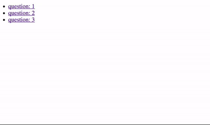

# MeteorReactReduxMCQ

## Preview

## Getting started

- ``meteor npm install`` then ``meteor``
- open browser in localhost:3000
- Play !

## Reset Game

- ``meteor reset``
- ``meteor``
- Play again !

## Things to improve

- Refactoring Question.jsx component
- Organize components by package with index.js for each
- Implementing containers with https://github.com/kadirahq/react-komposer
- Handling errors with https://github.com/meteor/validated-method
- Adding awesome design
